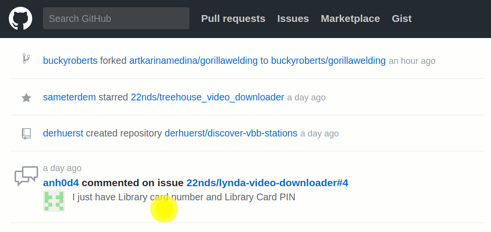

# Animated Pointer for Chrome and Firefox

It highlights clicks with animated circles.

## Instructions for Chromium
To enable extension follow these steps
- `Settings` > `More tools` > `Extensions`
- `Load unpacked extension`
- Select the folder with the extension

If you chnage the contents of the file Reload the extension by clicking on the link or `Ctrl + R`

When extension is enabled it shows animated pointer after each click.

### TODO
- On/off icon and code - to be aable to turn it of without disabling it.
- Add multiple animations
- Be able to choose your animation
